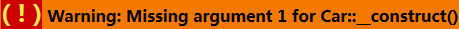
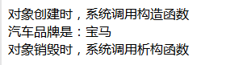

# 1.5 魔术方法和常量

为了更容易的使用对象，PHP提供了一些魔术方法，允许开发人员执行一些特殊的任务。

> 魔术方法的名称总是以两个下划线开始

## 1.5.1 构造函数 ***__construct()***

当一个类被实例化时，通常需要设置一些初始化参数。为了处理这个问题，PHP提供了一个魔术方法（ ***构造函数*** ）***__construct()*** ，每当创建一个新的对象时，该方法被自动调用。

为了说明构造函数的概念，我们在 *Car* 中添加了一个构造函数：

```PHP
class Car {

  public function __construct() {
    echo '汽车类的构造函数';
  }

}

// 创建类的实例
$bmw = new Car();
```

> 运行上面的代码，浏览器会打印出： **汽车类的构造函数**

## 1.5.2 构造函数传参

实例化类的时候，可以通过给构造函数传参，达到初始化类的目的。如下代码：

```PHP
class Car {
  // 私有属性
  private $model;

  public function __construct($model) {
    $this->model = $model;
  }

  public function getModel() {
    return '汽车品牌是：' . $this->model;
  }
}

// 创建类的实例
$bmw = new Car("宝马");
echo $bmw->getModel();
```

> 运行代码，浏览器会打印出 **汽车品牌是：宝马**

如果实例化类的时候忘记传参呢？这时会遇到下面错误：


```PHP

// 代码同上 ...

// 创建对象时，没有传递参数给构造函数
$bmw = new Car();
```

错误：



有种办法可以避免上面的错误，定义构造函数的时候，给参数指定默认值。如下：

```PHP
class Car {
  // 私有属性
  private $model;

  // 参数有默认值null
  public function __construct($model = '未知品牌') {
    $this->model = $model;
  }

  public function getModel() {
    return '汽车品牌是：' . $this->model;
  }
}

// 此时不会出错，因为当没有传递参数时，参数会有默认值
$bmw = new Car();

```

> 运行上面代码，浏览器输出 **汽车品牌：未知品牌**


## 1.5.2 析构函数 ***__destruct()***

当对象被销毁时，系统会调用析构函数。一般在析构函数中编写清理资源的代码（例如关闭数据库连接等）。

```PHP
class Car {
  // 私有属性
  private $model = "宝马";

  public function __construct($model) {
    $this->model = $model;
  }

  public function __destruct() {
    echo '对象销毁时，系统调用该函数';
  }

  public function getModel() {
    return '汽车品牌是：' . $this->model;
  }
}

$bmw = new Car();
echo $bmw->getModel();
```

运行后浏览器输出以下内容



从上可以看出，构造函数第一个被调用，析构函数最后被调用。

## 1.5.3 魔术常量 ***__CLASS*** ***__***

该常量用于获取当前类的名称

> ***__CLASS*** ***__*** 前后分别是两个下划线，同时字母大写形式

```PHP
class Car {
  // 私有属性
  private $model = "宝马";

  // 获取当前类的名称
  public function getClassName() {
    return "当前类的名称：" .  __CLASS__;
  }
}

$bmw = new Car();
echo $bmw->getClassName();
```

运行后，浏览器显示：
> 当前类的名称：Car

## 1.5.4 其他魔术常量

* ***__LINE*** ***__*** : 获取当前代码所在的行号
* ***__FILE*** ***__*** : 获取当前文件的目录结构，包含文件名
* ***__METHOD*** ***__*** : 获取当前方法名称


----------

【延伸阅读】

[>> 查看源文章地址 ](https://github.com/yiicode101/learn-php)

-------

***下一章节: 继承***
